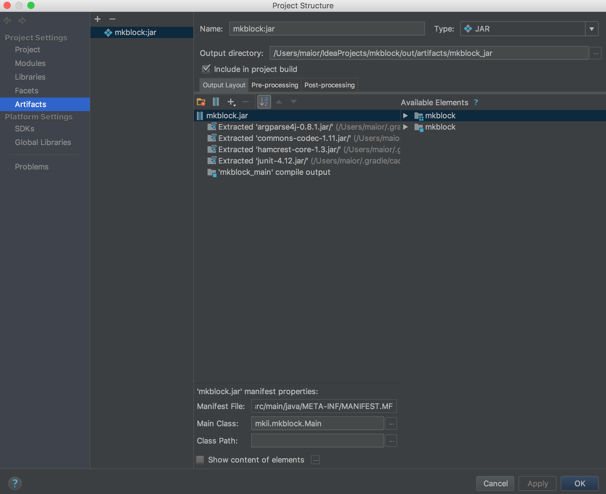

# mkblock
Blockchain(Server)
- This blockchain came from Codepace, which was not working. So i gotta hard time to modify many things and added client on it.
- Let's me know, if someone got hard time like me. i can give to you some help. :)

you have to install 2 things.
1. mkblock for server
2. mkc for client

Built With
- Intellij IDEA
- Gradle

How to Run
- Install Java 1.8.0 or higher
- Download mkblock from github.com : git clone https://github.com/maior/mkblock.git
- Modify your ip-address in "Constants.java": ex) "192.168.0.4:8787"
- Run>>"Run Main"
- if you wanna run mkblock.jar file, click "File>>Project Structure..." in menu.

Author
- Kenneth Kwon - maiordba@gmail.com

License
mkblock Core is released under the terms of the MIT license.
